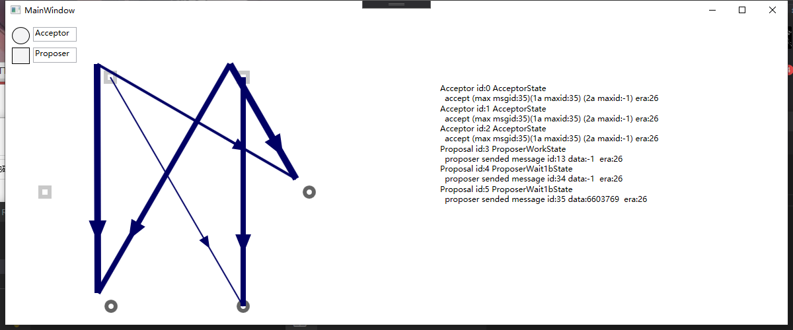

# Paxos
A toy Paxos implement by C# that can display the commucaition between Acceptor and Proposer.

It can be run in vs 2019 C# WPF in window, but older version vs also can.

It have been tested in a long time simulation, it seem I implement correctly, but I have no research other implement, so if it have bugs, calm down :D.

Aslo I found use visual studio is very annoyance compare to idea, so if I implement Paxos in javafx that day, maybe a better choice, just a complain.